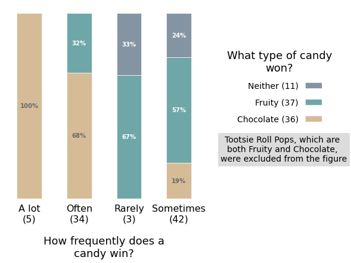
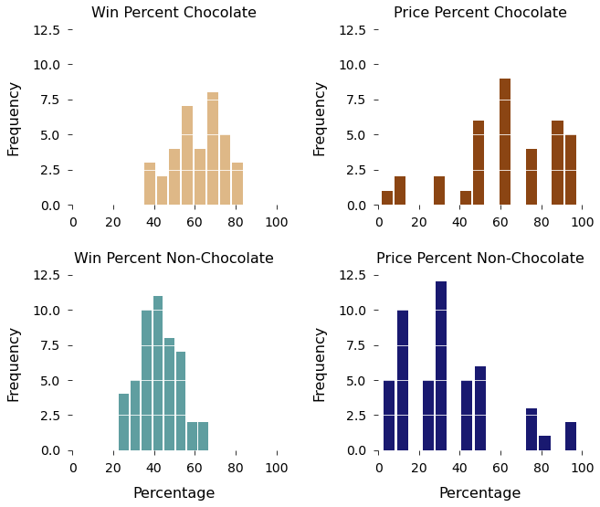
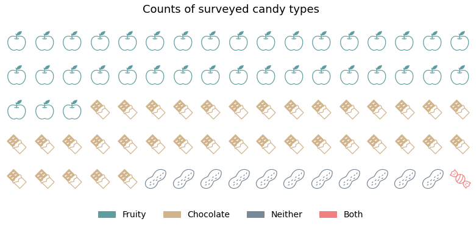

# Candy Wars

This project aimed to answer different questions through visualizations on [The Ultimate Halloween Candy Power Ranking](https://fivethirtyeight.com/videos/the-ultimate-halloween-candy-power-ranking/) data.  The data represents the results from an online survey conducted by fivethirtyeight where participants were asked which of two candies they preferred--the [original data](https://github.com/fivethirtyeight/data/tree/master/candy-power-ranking) was altered.  From this project, I learned how to create plots with the matplotlib library in Python.

## Questions

**Does chocolate reign supreme?**

‘Win_cat’ and ‘is_chocolate’ were the two variables used to relate to the win
percentage because these columns gave the frequency counts that could be converted
to percentages in the crosstab.  I didn’t use ‘win_percent’ because it is a continuous
variable that included distinct values so the graph would have had 84 unstacked bars.

From the visualization, frequent winners seen in the ‘A lot’ and ‘Often’ categories have
high win percentages of chocolate versus less frequent winners seen in the ‘Rarely’ and
‘Sometimes’ categories having high win percentages of fruity.

 

**How do chocolate and non-chocolate candies differ in winningness and price?**

Both winning percent distributions show a symmetrical mound shape centered around
60% for chocolate and 40% for non-chocolate. For the price percent distributions, the
shape shows a mounded curve that ascends upward towards 60% then tapering off in
chocolate and descends downward around 30% after rising up in non-chocolate.

 

**How many of each type of candy were in the original survey?**

