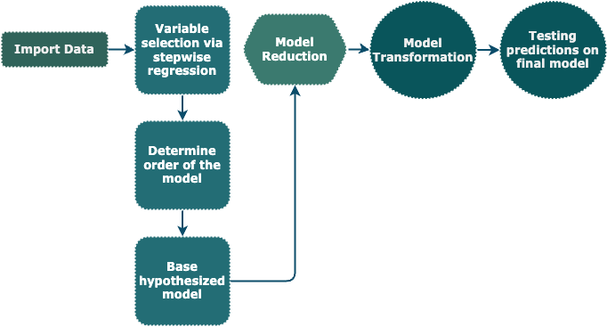

<style type="text/css">
  body{
    font-family: Times New Roman;
    font-size: 12pt;
    line-height: 2;
}
  h1{
    font-weight: bolder;
    font-size: 18pt;
}
  h2{
    font-weight: bold;
    font-size: 14pt;
}
.tab{
    display: inline-block;
    margin-left: 40px
}
</style>

***
# Outline {.tabset}

<span class="tab"></span>The goal of this project was to generate a statistically useful model that best predicts healthcare insurance charges through implementation of different regression techniques studied from a statistical data analysis course.  This was done by looking at a healthcare dataset and examining significant variables contributing to insurance charges and then building various multiple linear regression models to determine the best fitted.

<br>

```{r, echo = FALSE, out.width = '80%', fig.align = 'center'}
setwd("/Users/amard/Library/CloudStorage/OneDrive-William&Mary/W&M Materials & Courses/MATH_352_statistical_data_analysis/Final_project")

```

***
```{css, echo=FALSE}
/*css rule that limits the height of code blocks*/

/*Height of the output*/
pre {
  max-height: 300px;
  overflow-y: auto;
}

/*Height of the code block*/
pre[class] {
  max-height: 300px;
}
```

```{r, echo = FALSE}
library(glue)
```

## Functions {.tabset}
```{r}

# Functions

anova_hconclusion <- function(reduced, complete, alpha){
  #runs a nested F-test on the models of choice
    #reduced = model with the least terms; more parsimonious model
    #complete = model with the most terms
    #alpha = criteria to determine if the hypothesis claim is rejected or supported
  
  #checking if the reduced model class is a list of models
  #the argument input: list(list('modelname' = model), etc)
  if (class(reduced) == 'list'){
    
    #look at each model in the list individually
    for (m in seq_along(reduced)){
      
      #calculate p-value from the anova test
      pval <- anova(reduced[[m]][[1]], complete)$"Pr(>F)"
      pval <- pval[2]
      
      #test p-value and draw conclusion
      if (pval > alpha){
        
        print(glue('Complete: {deparse(substitute(complete))}
                    Reduced: {names(reduced[m][[1]])}
                    anova({names(reduced[m][[1]])}, {deparse(substitute(complete))}) 
                    Global F p-value: {signif(pval, 4)}
                    Conclusion: fail to reject the null, all extra beta terms in complete model are not significant for predicting y
                    Model to use: {names(reduced[m][[1]])}'))
        cat('\n') #spacing between outputs
      }
      else{
        print(glue('Complete: {deparse(substitute(complete))}
                    Reduced: {names(reduced[m][[1]])}
                    anova({names(reduced[m][[1]])}, {deparse(substitute(complete))}) 
                    Global F p-value: {signif(pval, 4)}
                    Conclusion: reject the null, at least one extra beta term in complete model is significant for predicting y
                    Model to use: {deparse(substitute(complete))}'))
        cat('\n')
      }
    }
  }
  
  #checking if the reduced model class is linear, only one model
  if (class(reduced) == 'lm'){
    pval <- anova(reduced, complete)$"Pr(>F)"
    pval <- pval[2]
    
    if (pval > alpha){
      print(glue('Complete: {deparse(substitute(complete))}
                    Reduced: {deparse(substitute(reduced))}
                    anova({deparse(substitute(reduced))}, {deparse(substitute(complete))}) 
                    Global F p-value: {signif(pval, 4)}
                    Conclusion: fail to reject the null, all extra beta terms in complete model are not significant for predicting y
                    Model to use: {deparse(substitute(reduced))}'))
    }
    else{
      print(glue('Complete: {deparse(substitute(complete))}
                    Reduced: {deparse(substitute(reduced))}
                    anova({deparse(substitute(reduced))}, {deparse(substitute(complete))}) 
                    Global F p-value: {signif(pval, 4)}
                    Conclusion: reject the null, at least one extra beta term in complete model is significant for predicting y
                    Model to use: {deparse(substitute(complete))}'))
    }
  }
}

cv <- function(model){ 
  #calculates the coefficient of variation: (residual error/mean of y) *100
  print((summary(model)$sigma/mean(insurance$charges)) * 100)
}
```

***
## Data
<span class="tab"></span>The data comes from the [“Healthcare Insurance”](https://www.kaggle.com/datasets/willianoliveiragibin/healthcare-insurance/data) dataset found on Kaggle which comprises of 1,338 observations representing insured individuals:
```{r}
insurance <- read.csv("insurance.csv")
head(insurance, 5)
```
There are six key independent variables, three quantitative and three qualitative.  The quantitative variables are `age`, `BMI`, and `children` which represent the insured individual’s age, body mass index, and the number of dependents they cover.  The qualitative variables are `sex`, `smoker`, and `region` which represent the insured individual’s gender as male or female, status as smoker or non-smoker, and geographic region of residence from the following regions: southwest, southeast, northwest, and northeast.  The dependent variable is “charges” representing the insurance cost incurred by each insured individual in thousands of dollars.

***
## Stepwise Regression 
<span class="tab"></span>Before creating models, stepwise regression was applied to see which variables are important predictors for the dependent variable.  Specifically, forward stepwise regression was used which added the variable term to the model equation if the variable term’s Akaike Information Criterion was the smallest (AIC).  The AIC acts as a measure of quality for the statistical models, so using the AIC in this regression procedure means that the lowest AIC value for a variable term would make it important for adding to the model.  Although it may not seem like stepwise regression should be used here since there are not many features, it is one of the useful variable screening method practices if there were: 

```{r}
min.model = lm(charges ~1, data = insurance) #starts with the intercept
step(min.model,
     scope = (~age + sex + bmi + children + smoker + region), #all variables of interest
     data = insurance,
     direction = 'forward') #adds the variable with the smallest AIC to the model after each iteration
```

<span class="tab"></span>From the results of the regression, it appears that `sex` is the only term that is not important for predicting healthcare insurance costs–the procedure finishes once the threshold AIC used from the previous smallest variable term does not contain any terms smaller than it.  However, I decided to add `sex` in the proceeding model formations because it does seem like a variable of interest in this analysis since there are cases of gender bias in areas such as insurance.  This reveals one caveat of stepwise regression in that there could be a variable of interest that is regarded as unimportant in which intuition would need to come into play.

## Visualizing Quantitative and Dependent Variable Relationships <br>
<span class="tab"></span>The relationships between the quantitative and the dependent variables were visualized in order to determine which ordered term the model should use.  I chose to do this before randomly building the theoretical model so that I could have more leverage in creating a model that is on the path of generating good predictions from its precise fitted line.  To note, this was only done to the quantitative variables because it would be meaningless to assign higher orders to qualitative variables:

```{r, fig.align = "center", fig.width = 10, fig.height = 10, fig}
par(mfrow = c(2, 2), mar = c(6, 6, 0.5, 0.5))
plot(insurance$age, insurance$charges, xlab = 'Age', ylab = 'Insurance cost')
plot(insurance$bmi, insurance$charges, xlab = 'BMI', ylab = 'Insurance cost') 
plot(insurance$children, insurance$charges, xlab = 'Children', ylab = 'Insurance cost')
```

In the graphs, it appears that `age` and `children` look curvilinear while `BMI` looks linear which means that a second-order model should be the highest order used for the model formations.

## Building a Hypothesized Model <br>
<span class="tab"></span>In figuring out the highest order, I then started with a base model with all possible combinations for a second-order complete linear model:
<br>

$E(y) = \beta_{0} + \beta_{1}x_{1} + \beta_{2}x_{2} + \beta_{3}x_{3} + \beta_{4}x_{1}x_{2} + \beta_{5}x_{1}x_{3} + \beta_{6}x_{2}x_{3} + \beta_{7}x_{1}^2 + \beta_{8}x_{2}^2 + \beta_{9}x_{4} + \beta_{10}x_{5} + \beta_{11}x_{6} + \beta_{12}x_{7} + \beta_{13}x_{8} + \\ \hspace{12 mm} \\ \hspace{12 mm} \beta_{14}x_{4}x_{5} + \beta_{15}x_{4}x_{6} + \beta_{16}x_{4}x_{7} + \beta_{17}x_{4}x_{8} + \beta_{18}x_{5}x_{6} + \beta_{19}x_{5}x_{7} + \beta_{20}x_{5}x_{8} + \\ \hspace{12 mm} \\ \hspace{12 mm} \beta_{21}x_{1}x_{4} + \beta_{22}x_{1}x_{5} + \beta_{23}x_{1}x_{6} + \beta_{24}x_{1}x_{7} + \beta_{25}x_{1}x_{8} + \beta_{26}x_{1}x_{4}x_{5} + \beta_{27}x_{1}x_{4}x_{6} + \beta_{28}x_{1}x_{4}x_{7} + \beta_{29}x_{1}x_{4}x_{8} + \beta_{30}x_{1}x_{5}x_{6} + \beta_{31}x_{1}x_{5}x_{7} + \beta_{32}x_{1}x_{5}x_{8} + \\ \hspace{30 mm} ⋮ \\ \hspace{12 mm} \beta_{105}x_{2}^2x_{4} + \beta_{106}x_{2}^2x_{5} + \beta_{107}x_{2}^2x_{6} + \beta_{108}x_{2}^2x_{7} + \beta_{109}x_{2}^2x_{8} + \beta_{110}x_{2}^2x_{4}x_{5} + \beta_{111}x_{2}^2x_{4}x_{6} + \beta_{112}x_{2}^2x_{4}x_{7} + \beta_{113}x_{2}^2x_{4}x_{8} + \beta_{114}x_{2}^2x_{5}x_{6} + \beta_{115}x_{2}^2x_{5}x_{7} + \beta_{116}x_{2}^2x_{5}x_{8}$

<br>
where,

$x_{1} = \text{age}$ &nbsp; &nbsp; &nbsp; $x_{2} = \text{children}$ &nbsp; &nbsp; &nbsp; $x_{3} = \text{BMI}$

<br>

$x_{4}\text{(sex)} = \begin{cases} 1 &\quad \text{male}\\ 0 &\quad \text{female} \end{cases}$ &nbsp; &nbsp; &nbsp; $x_{5}\text{(smoker)} = \begin{cases} 1 &\quad \text{yes}\\ 0 &\quad \text{no} \end{cases}$

<br>

$x_{6}\text{(region)} = \begin{cases} 1 &\quad \text{Northwest}\\ 0 &\quad \text{other} \end{cases}$ &nbsp; &nbsp; &nbsp; $x_{7}\text{(region)} = \begin{cases} 1 &\quad \text{Southest}\\ 0 &\quad \text{other} \end{cases}$ &nbsp; &nbsp; &nbsp; $x_{8}\text{(region)} = \begin{cases} 1 &\quad \text{Southwest}\\ 0 &\quad \text{other} \end{cases}$ 

<br>

$x_{6} = x_{7} = x_{8} = \text{Northeast}$

## Reducing the Base Model <br>
<span class="tab"></span>Following the base model I decided which variables and interactions to include and/or exclude from a series of nested F-tests.  The process of selecting the variables and interactions were methodical in regards to the terms being quadratic or having different combinations of interactions between quadratic, qualitative, and quantitative variables, not in regards to the meaning of the variables to each other.

<span class="tab"></span>When conducting the nested F-tests, I first started with the complete model which was the base model and the reduced models which were the models nested within the complete model but with smaller terms.  An anova test was then run between the complete model and each individual reduced model to find the p-value.  For the hypotheses, the null was that all extra beta terms in the complete model equal zero meaning that those terms are not significant for predicting the dependent variable and the alternative was that at least one of those beta terms in the complete model does not equal zero meaning that the term is significant. 

$$H_{0}: \text{all added}~\beta_{i}~\text{terms in complete model} = 0$$
$$H_{a}: \text{at least one}~\beta_{i}~\text{in the added terms in complete model} \neq 0$$ 

By evaluating the p-value, if it was smaller than a specified alpha value, it would reject the null and support the claim that the complete model should be used.  If it was larger, it would fail to reject the null and reveal that there’s insufficient evidence to support those extra beta terms being significant meaning that the reduced model should be used.  If the reduced model was used, the procedure was repeated to see if that model could be further reduced, this time with the reduced model acting as the complete model for which the terms would be eliminated from.

```{r, echo = FALSE}
# All of the models to compare with the base model
# Start with a base model:
model1 <- lm(charges ~ age + children + bmi + age*children + age*bmi + children*bmi + I(age^2) + I(children^2)
                       + sex + smoker + region + sex*smoker + sex*region + smoker*region
                       + age*sex + age*smoker + age*region + age*sex*smoker + age*sex*region + age*smoker*region
                       + children*sex + children*smoker + children*region + children*sex*smoker + children*sex*region + children*smoker*region
                       + bmi*sex + bmi*smoker + bmi*region + bmi*sex*smoker + bmi*sex*region + bmi*smoker*region
                       + age*children*sex + age*children*smoker + age*children*region + age*children*sex*smoker + age*children*sex*region + age*children*smoker*region
                       + age*bmi*sex + age*bmi*smoker + age*bmi*region + age*bmi*sex*smoker + age*bmi*sex*region + age*bmi*smoker*region
                       + children*bmi*sex + children*bmi*smoker + children*bmi*region + children*bmi*sex*smoker + children*bmi*sex*region + children*bmi*smoker*region
                       + I(age^2)*sex + I(age^2)*smoker + I(age^2)*region + I(age^2)*sex*smoker + I(age^2)*sex*region + I(age^2)*smoker*region
                       + I(children^2)*sex + I(children^2)*smoker + I(children^2)*region + I(children^2)*sex*smoker + I(children^2)*sex*region + I(children^2)*smoker*region,
             data = insurance) #117 betas
#note: this model has 117 betas including the intercept, need to reduce the model to be computational efficient

# Other models:
#removing all quadratic terms
model2 <- lm(charges ~ age + children + bmi + age*children + age*bmi + children*bmi
             + sex + smoker + region + sex*smoker + sex*region + smoker*region
             + age*sex + age*smoker + age*region + age*sex*smoker + age*sex*region + age*smoker*region
             + children*sex + children*smoker + children*region + children*sex*smoker + children*sex*region + children*smoker*region
             + bmi*sex + bmi*smoker + bmi*region + bmi*sex*smoker + bmi*sex*region + bmi*smoker*region
             + age*children*sex + age*children*smoker + age*children*region + age*children*sex*smoker + age*children*sex*region + age*children*smoker*region
             + age*bmi*sex + age*bmi*smoker + age*bmi*region + age*bmi*sex*smoker + age*bmi*sex*region + age*bmi*smoker*region
             + children*bmi*sex + children*bmi*smoker + children*bmi*region + children*bmi*sex*smoker + children*bmi*sex*region + children*bmi*smoker*region,
             data = insurance) #91 betas

#removing all quantitative*qualitative interactions
model3 <- lm(charges ~ age + children + bmi + age*children + age*bmi + children*bmi + I(age^2) + I(children^2)
             + sex + smoker + region + sex*smoker + sex*region + smoker*region,
             data = insurance) #21 betas

#removing all quadratic*qualitative interactions
model4 <- lm(charges ~ age + children + bmi + age*children + age*bmi + children*bmi + I(age^2) + I(children^2)
             + sex + smoker + region + sex*smoker + sex*region + smoker*region
             + age*sex + age*smoker + age*region + age*sex*smoker + age*sex*region + age*smoker*region
             + children*sex + children*smoker + children*region + children*sex*smoker + children*sex*region + children*smoker*region
             + bmi*sex + bmi*smoker + bmi*region + bmi*sex*smoker + bmi*sex*region + bmi*smoker*region
             + age*children*sex + age*children*smoker + age*children*region + age*children*sex*smoker + age*children*sex*region + age*children*smoker*region
             + age*bmi*sex + age*bmi*smoker + age*bmi*region + age*bmi*sex*smoker + age*bmi*sex*region + age*bmi*smoker*region
             + children*bmi*sex + children*bmi*smoker + children*bmi*region + children*bmi*sex*smoker + children*bmi*sex*region + children*bmi*smoker*region,
             data = insurance) #93 betas
```

```{r}
# First nested F-tests
model_list <- list(list('model2' = model2), #removes quadratic terms
                   list('model3' = model3), #removes quantitative*qualitative interactions
                   list('model4' = model4)) #removes quadratic*qualitative interactions
anova_hconclusion(reduced = model_list, complete = model1, alpha = 0.05)
```

```{r, echo = FALSE}
#more models to compare
#removing qualitative*qualitative interactions
model5 <- lm(charges ~ age + children + bmi + age*children + age*bmi + children*bmi + I(age^2) + I(children^2)
             + sex + smoker + region
             + age*sex + age*smoker + age*region
             + children*sex + children*smoker + children*region
             + bmi*sex + bmi*smoker + bmi*region
             + age*children*sex + age*children*smoker + age*children*region
             + age*bmi*sex + age*bmi*smoker + age*bmi*region
             + children*bmi*sex + children*bmi*smoker + children*bmi*region,
             data = insurance) 
```

```{r}
# Second nested F-tests
anova_hconclusion(reduced = model5, #removes qualitative*qualitative interactions
                  complete = model4, alpha = 0.05)
```

```{r, echo = FALSE}
#more models
#removing quantitative*quantitative interactions
model6 <- lm(charges ~ age + children + bmi + I(age^2) + I(children^2)
             + sex + smoker + region
             + age*sex + age*smoker + age*region
             + children*sex + children*smoker + children*region
             + bmi*sex + bmi*smoker + bmi*region,
             data = insurance) #26 betas

#removing all quadratic terms
model7 <- lm(charges ~ age + children + bmi
             + sex + smoker + region
             + age*sex + age*smoker + age*region
             + children*sex + children*smoker + children*region
             + bmi*sex + bmi*smoker + bmi*region,
             data = insurance) #24 betas
```

```{r}
# Third nested F-tests
model_list <- list(list('model6' = model6), #removes quantitative*quantitative interactions
                   list('model7' = model7)) #removes quadratic terms
anova_hconclusion(reduced = model_list, complete = model5, alpha = 0.05)
```
After the tests, model 6 appears to be the best model which removes the quadratic to qualitative, qualitative to qualitative, and quantitative to quantitative interactions.  Looking at the `summary()` output can further explain the performance of this model to see if there should be any other changes to it:

```{r}
summary(model6)
```
<span class="tab"></span>Looking at the model summary, it passes the global F-test from its small p-value signaling that the model is useful for predicting insurance charges (the hypotheses being that all beta terms in the model equal zero as the null and that at least one of those terms does not equal zero for the alternative) and about 84% of the sample variation in insurance charges is explained by the model interpreted from the adjusted R-squared value. However the residual standard error seems relatively high suggesting issues within the residuals of the model. A Coefficient of Variation (CV) was calculated to support this argument, with the standard error being divided by the mean of the sampling distribution and multiplied by 100.  The rule of thumb is that a CV less than 10% would mean that the residual standard error is small, here it is larger with 36%.  So now to put this into perspective, the standard error value here represents the observed insurance charges to be within &pm; 2s of their predicted values.  This means that there is about a \$9,400 range for the values to fall between their predictions, which entails a bad model as the prediction intervals are very large and open to errors.
```{r}
# Coefficient of Variation
(summary(model6)$sigma/mean(insurance$charges)) * 100
```

## Model Transformation <br>
<span class="tab"></span>The high residual standard error suggests that the residuals of the model should be looked at to see if any assumptions on the error term are violated:

```{r, fig.show = 'hold', out.width = 350}
par(mar = c(4, 6, 1, 0.1))

# Constant variance assumption
yhat_6 <- predict(model6)
plot(yhat_6, model6$residuals, xlab = 'Fitted Values', ylab = 'Residuals')
abline(h = 0)

# Normality assumption
qqnorm(model6$residuals)
qqline(model6$residuals)
```
<br>

Here I only tested two assumptions for the residual errors: constant variance and normality assumptions. In the first plot, the constant variance assumption is violated as the residuals do not look to be equally distributed. The second plot shows that the residuals look rightly skewed, violating the normality assumption. One way to resolve this issue is to apply a variance-stabilizing transformation on the residuals which would help with the heteroscedastic errors and in turn could help pass the normality assumption.

<span class="tab"></span>A natural log transformation was applied to the model as the shape of the residual distribution in the first plot seems somewhat cone-shaped.  With this new model, I viewed the summary output again to see the performance and residuals of this model:

$ln(y) = \beta_{0} + \beta_{1}x_{1} + \beta_{2}x_{2} + \beta_{3}x_{3} + \beta_{4}x_{1}^2 + \beta_{5}x_{2}^2 + \beta_{6}x_{4} + \beta_{7}x_{5} + \beta_{8}x_{6} + \beta_{9}x_{7} + \beta_{10}x_{8} + \\ \hspace{12 mm} \\ \hspace{12 mm} \beta_{11}x_{1}x_{4} + \beta_{12}x_{1}x_{5} + \beta_{13}x_{1}x_{6} + \beta_{14}x_{1}x_{7} + \beta_{15}x_{1}x_{8} + \\ \hspace{12 mm} \\ \hspace{12 mm} \beta_{16}x_{2}x_{4} + \beta_{17}x_{2}x_{5} + \beta_{18}x_{2}x_{6} + \beta_{19}x_{2}x_{7} + \beta_{20}x_{2}x_{8} + \\ \hspace{12 mm} \\ \hspace{12 mm} \beta_{21}x_{3}x_{4} + \beta_{22}x_{3}x_{5} + \beta_{23}x_{3}x_{6} + \beta_{24}x_{3}x_{7} + \beta_{25}x_{3}x_{8} + \epsilon$

```{r, echo = FALSE}
# final model
model8 <- lm(log(charges) ~ age + children + bmi + I(age^2) + I(children^2)
             + sex + smoker + region
             + age*sex + age*smoker + age*region
             + children*sex + children*smoker + children*region
             + bmi*sex + bmi*smoker + bmi*region,
             data = insurance) #26 betas
```

```{r}
summary(model8)
```
In this summary output the transformed model is useful for predicting insurance charges from the global F-test p-value, about 83% of sample variation in insurance charges is explained by the model, and the residual standard error is relatively small having the CV value at 4.13%.  In the previous untransformed model, the residual standard error represents the dollar amount of insurance charges, but here in the transformed model it represents the percentage of the insurance charges.  So to convert it back to the dollar amount, this calculation was applied:

```{r}
# Converting insurance charge percentage to insurance charge cost (in thousands of dollars)
(exp(2 * 0.3762) - 1) * 1000
```
Now the insurance charges of this transformed model lie within \$1,122 of their predicted values.  This is a closer interval than the previous interval with around \$9,400.

```{r, fig.show = 'hold', out.width = 350}
par(mar = c(4, 6, 1, 0.1))

# Constant variance assumption
yhat_8 <- predict(model8)
plot(yhat_8, model8$residuals, xlab = 'Fitted Values', ylab = 'Residuals') 
abline(h = 0)

# Normality assumption
qqnorm(model8$residuals)
qqline(model8$residuals)
```
<br>

And for the residuals of this model, they appear to follow the assumptions of constant variance and normality as the first plot has a cluster of residuals equally distributed and the second plot shows the residuals normally distributed.  However, some of the residuals for both plots cause the assumptions to be violated as they make the overall residuals either heteroscedastic or rightly skewed.  This issue may be attributed with outliers in the original data.  Since this model has a relatively smaller residual standard error than the previous models, I decided to test the predictions with this model despite its residuals not following its assumptions.

## Testing Predictions <br>
<span class="tab"></span>With the information gathered, I concluded that the natural log transformed model was the best statistically useful model to use for prediction–a second-order multiplicative linear regression model with quantitative to qualitative interaction:

$ln(y) = \beta_{0} + \beta_{1}x_{1} + \beta_{2}x_{2} + \beta_{3}x_{3} + \beta_{4}x_{1}^2 + \beta_{5}x_{2}^2 + \beta_{6}x_{4} + \beta_{7}x_{5} + \beta_{8}x_{6} + \beta_{9}x_{7} + \beta_{10}x_{8} + \\ \hspace{12 mm} \\ \hspace{12 mm} \beta_{11}x_{1}x_{4} + \beta_{12}x_{1}x_{5} + \beta_{13}x_{1}x_{6} + \beta_{14}x_{1}x_{7} + \beta_{15}x_{1}x_{8} + \\ \hspace{12 mm} \\ \hspace{12 mm} \beta_{16}x_{2}x_{4} + \beta_{17}x_{2}x_{5} + \beta_{18}x_{2}x_{6} + \beta_{19}x_{2}x_{7} + \beta_{20}x_{2}x_{8} + \\ \hspace{12 mm} \\ \hspace{12 mm} \beta_{21}x_{3}x_{4} + \beta_{22}x_{3}x_{5} + \beta_{23}x_{3}x_{6} + \beta_{24}x_{3}x_{7} + \beta_{25}x_{3}x_{8} + \epsilon$

<br>
where,

$x_{1} = \text{age}$ &nbsp; &nbsp; &nbsp; $x_{2} = \text{children}$ &nbsp; &nbsp; &nbsp; $x_{3} = \text{BMI}$

<br>

$x_{4}\text{(sex)} = \begin{cases} 1 &\quad \text{male}\\ 0 &\quad \text{female} \end{cases}$ &nbsp; &nbsp; &nbsp; $x_{5}\text{(smoker)} = \begin{cases} 1 &\quad \text{yes}\\ 0 &\quad \text{no} \end{cases}$

<br>

$x_{6}\text{(region)} = \begin{cases} 1 &\quad \text{Northwest}\\ 0 &\quad \text{other} \end{cases}$ &nbsp; &nbsp; &nbsp; $x_{7}\text{(region)} = \begin{cases} 1 &\quad \text{Southest}\\ 0 &\quad \text{other} \end{cases}$ &nbsp; &nbsp; &nbsp; $x_{8}\text{(region)} = \begin{cases} 1 &\quad \text{Southwest}\\ 0 &\quad \text{other} \end{cases}$ 

<br>

$x_{6} = x_{7} = x_{8} = \text{Northeast}$

Now this model can be used to test its predictions with the observed insurance charges:
```{r}
# Percentage of Insurance Charges
insurance <- transform(insurance, log_charges = log(charges)) #new column of transformed values
prediction_table_log <- cbind(insurance$log_charges, predict(model8, interval = "prediction"))

# Dollar Amount of Insurance Charges
prediction_table_log <- data.frame(prediction_table_log) #converting matrix to dataframe
prediction_table <- transform(prediction_table_log, V1 = exp(V1), #observed value
                                                    fit = exp(fit), #predicted value
                                                    #prediction interval
                                                    lwr = exp(lwr),
                                                    upr = exp(upr))
```

```{r}
prediction_table_log
```

```{r}
prediction_table
```

```{r, out.width = '60%', fig.align = 'center'}
# Insurance charge costs, not percentages
par(mar = c(4, 6, 1, 0.1))
plot(prediction_table$V1, prediction_table$fit, xlab = "Predicted Values", ylab = "Observed Values")
abline(a = 0, b = 1, lwd = 2)
```

In the final plot, the observed insurance charges are relatively close to the predicted insurance charges for this model despite some outliers.  So from seven different models, this derived model reveals good predictions on insurance charges given the data.  If this model were to be further analyzed in attempts to produce closer predictions, the next possible procedure could be to try weighted least squares to limit the outliers and address the residual error assumption violations with this model.  Also, rather than looking solely at the predictions, another way to test the performance of this model could be implementing a cross-validation where the data is tested on an unseen portion of the existing data.
