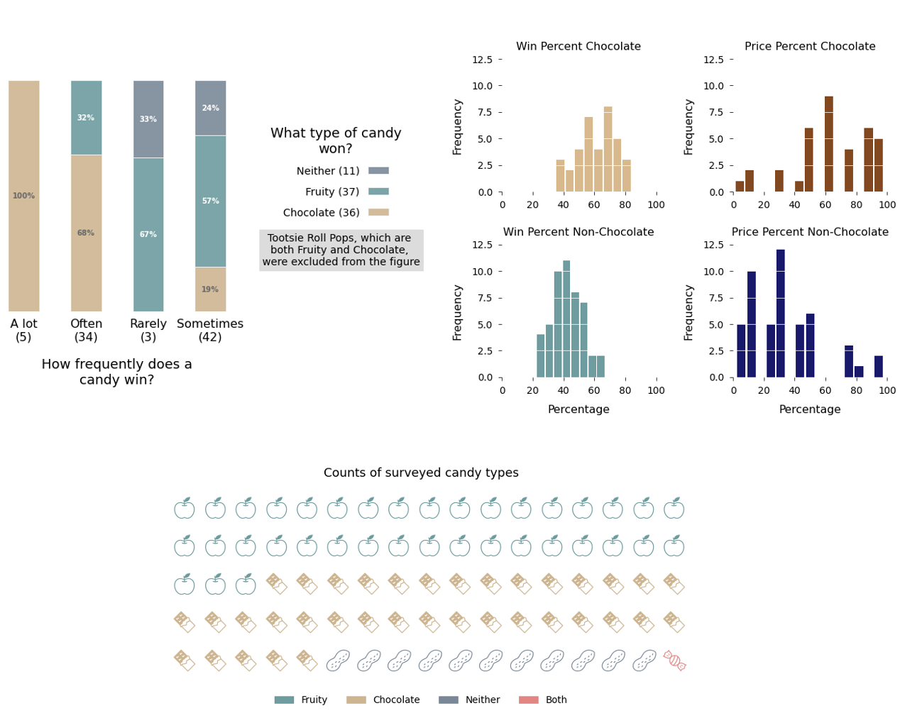
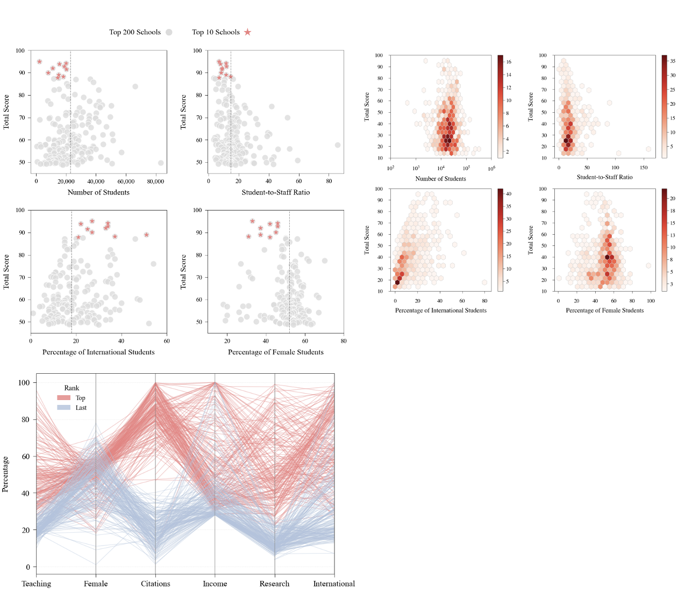
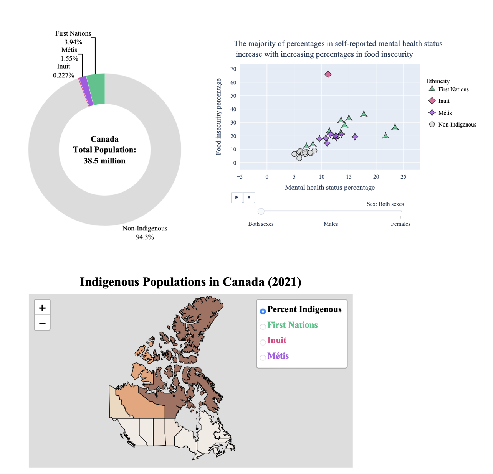
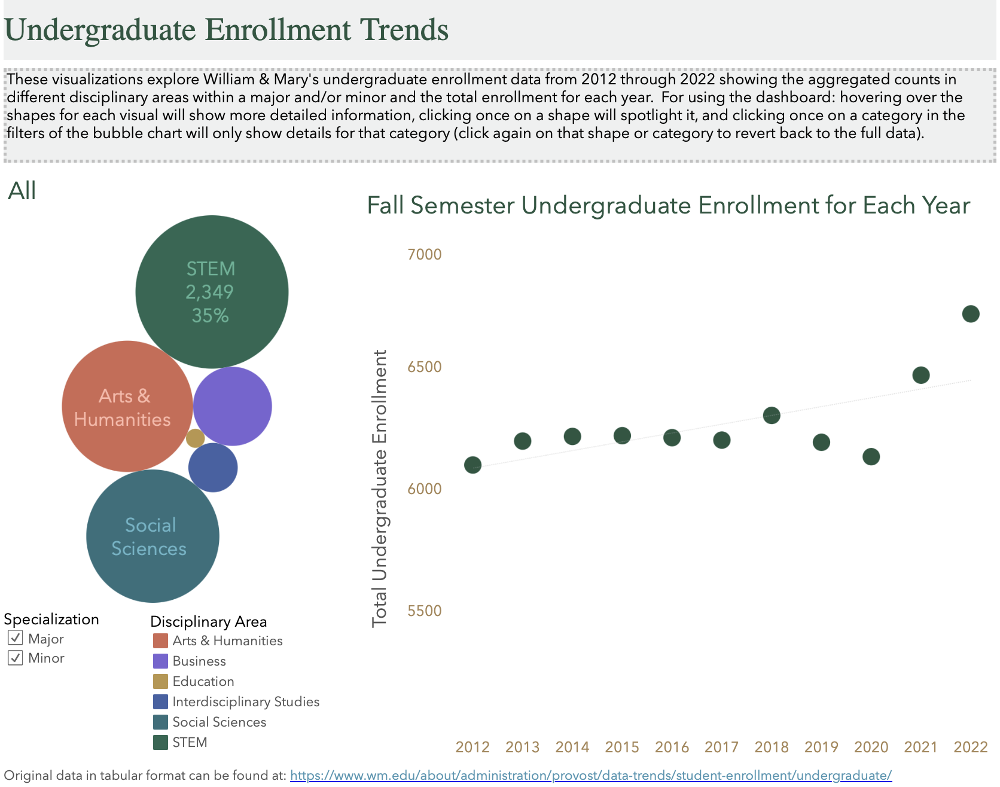
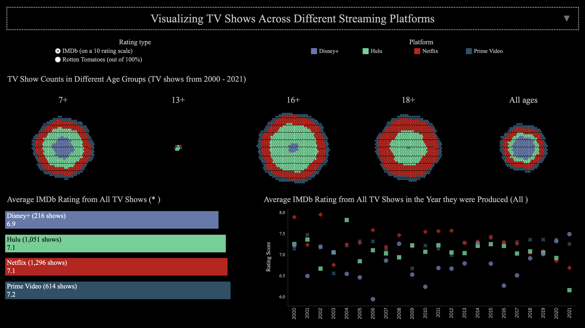

# Project Descriptions
This is a collection of projects worked on throughout a semester in data visualization and data analysis courses at William & Mary.  The projects are oriented around the concepts learned in those courses:

### Candy Wars Visualizations

This project aimed to answer different questions through visualizations on [The Ultimate Halloween Candy Power Ranking](https://fivethirtyeight.com/videos/the-ultimate-halloween-candy-power-ranking/) data.  The data represents the results from an online survey conducted by fivethirtyeight where participants were asked which of two candies they preferred--the [original data](https://github.com/fivethirtyeight/data/tree/master/candy-power-ranking) was altered.  From this project, I learned how to create plots with the matplotlib library in Python.

### University Rankings Visualizations

This project examined trends in the rankings from [The Higher Education University Rankings](https://www.timeshighereducation.com/world-university-rankings/2016/world-ranking/detailed) through usage of different visualizations–the [original data](https://www.kaggle.com/datasets/mylesoneill/world-university-rankings) was altered.  Here I learned how to implement parallel coordinates and hexagonal binning plots with the matplotlib library in Python to reveal patterns in the data.

### [Mental Health in Canadian Indigenous Populations Interactive Visualizations](https://dunham-amar.github.io/Data-Visualization-and-Analytics-Projects/Visualization%20Projects/Mental%20Health%20in%20Canadian%20Indigenous%20Populations/index.html)

In this project, I used interactive visualizations to explore the proportion, location, and mental health relationships of three Canadian Indigenous populations: First Nations, Inuit, and Métis. The data was modified from the 2021 Canadian Census which contains the population counts for provinces and territories in Canada. From this project, I learned how to create interactive donut, choropleth, and scatterplot visuals using the plotly and folium libraries in Python.

### [Undergraduate Enrollment Data](https://public.tableau.com/app/profile/amar.dunham/viz/undergraduate_enrollment_data/Undergraddashboard)

This project looked at the trends seen in the overall enrollment over the years and the studied fields at William & Mary.  I learned how to utilize the properties and tools found in Tableau for creating a bubble and dot chart as a dashboard.

### [TV Show Ratings Across Different Streaming Platforms](https://public.tableau.com/app/profile/amar.dunham/viz/final_project_visualizations/Dashboard1)

For this project I examined the age and user ratings for TV shows found on various streaming platforms.  The visualizations were oriented around addressing what type of age groups certain platforms may cater to, what year of tv shows were highly rated, and which platforms have the highest average rating scores.  I was able to further my understanding of the practices in Tableau and create a new learned plot, the circle grid.

### [Healthcare Insurance Analysis](https://rpubs.com/dmar/1140633)
This analysis underwent the steps for generating a linear regression model that best fits the data on healthcare insurance.  I learned the concepts behind the different regression techniques and a general intuition for the certain techniques that were implemented.
