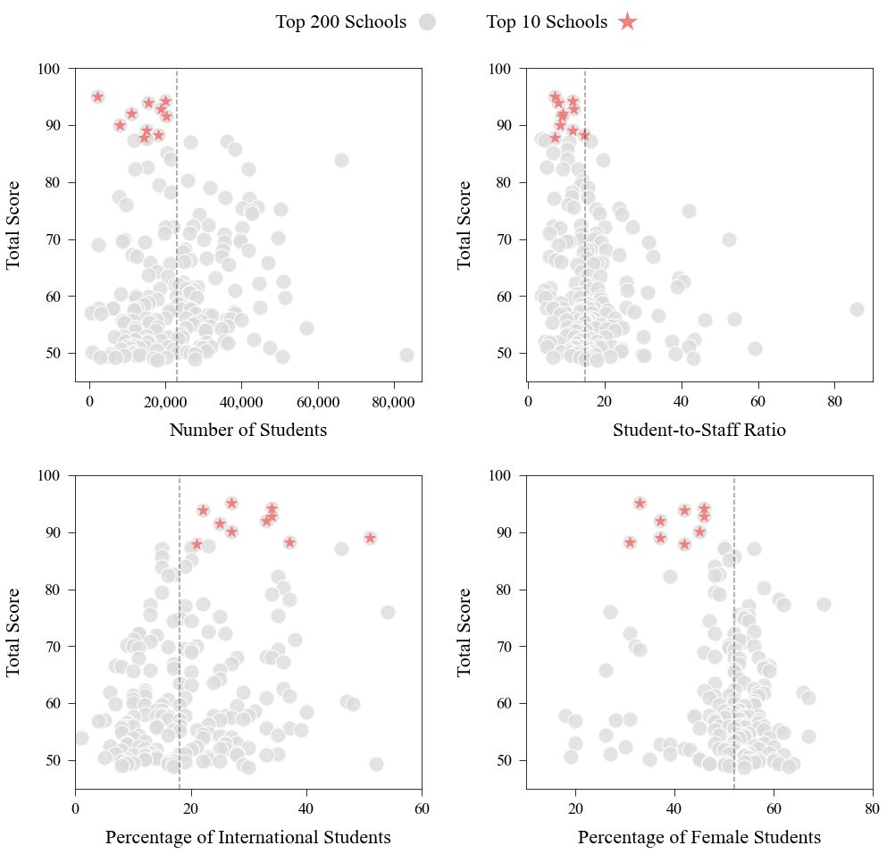
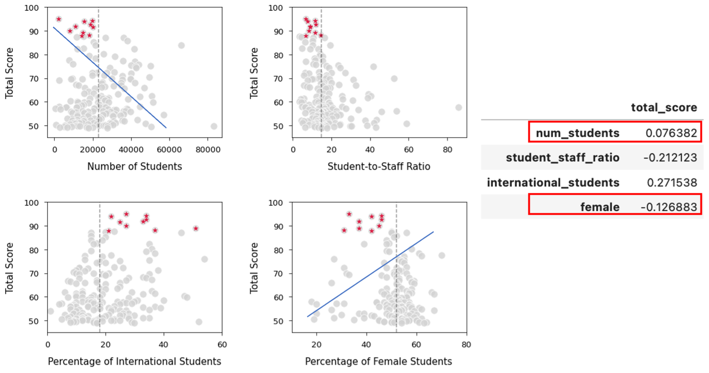
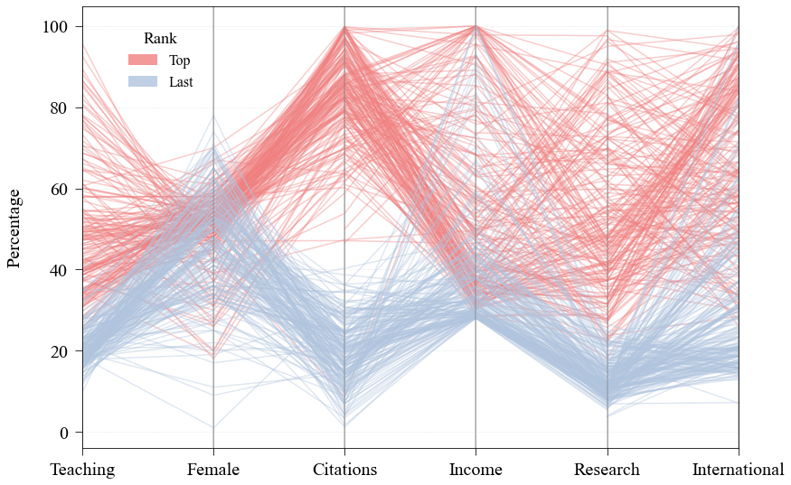
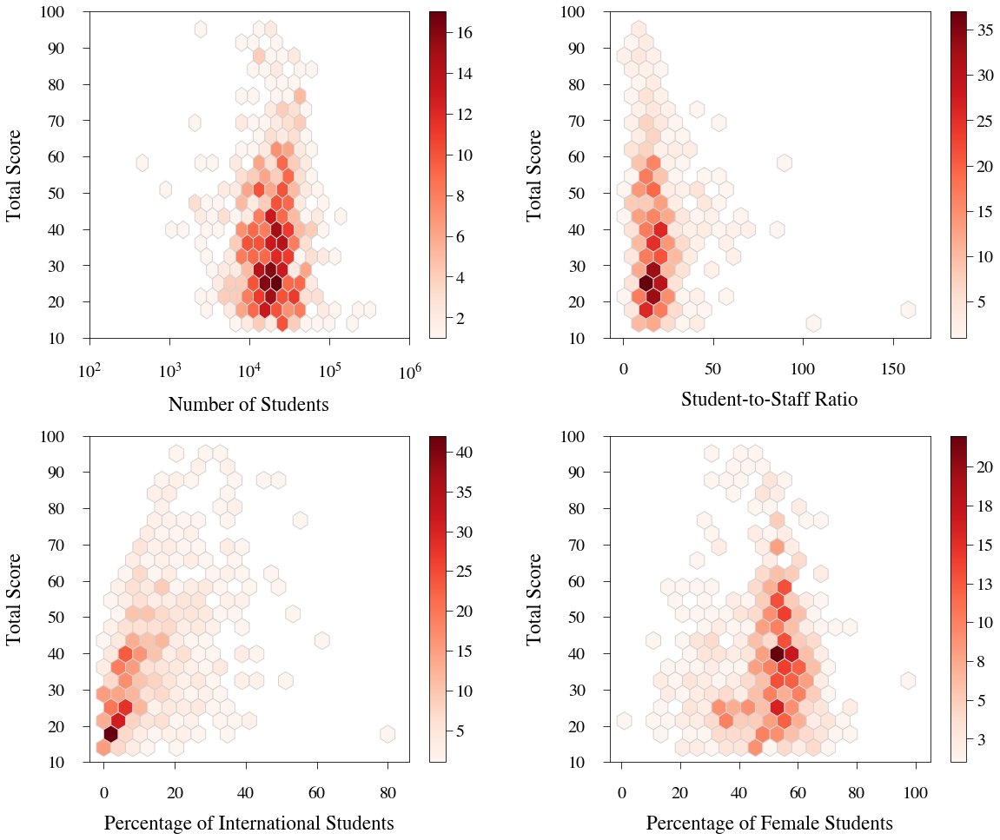

# University Rankings

This project examined trends in the rankings from [The Higher Education University Rankings](https://www.timeshighereducation.com/world-university-rankings/2016/world-ranking/detailed) through usage of different visualizations–the [original data](https://www.kaggle.com/datasets/mylesoneill/world-university-rankings) was altered.  Here I learned how to implement parallel coordinates and hexagonal binning plots with the matplotlib library in Python to reveal patterns in the data.

## Tasks

**Zooming in on the Top 200**
Create a set of scatterplots as a figure with 4 subplots in a 2x2 grid. Each scatterplot will have on x one of the following variables:

`num_students` (count of total number of students) &nbsp;&nbsp;&nbsp;&nbsp;&nbsp;&nbsp;&nbsp;&nbsp;&nbsp;&nbsp;&nbsp;&nbsp;&nbsp;&nbsp;&nbsp;&nbsp;&nbsp;&nbsp;`student_staff_ratio`
`international_students` (percent of international students) &nbsp;&nbsp;&nbsp; `female` (percent of female students)

Add a vertical line to represent the median of the x variable on each plot. Every scatterplot should have the total score (total_score) on y.

From the table of correlation coefficients, the correlation coefficients for the number of students and the percentage of female students seem to be misleading based off the
scatter distribution on their plots. For a positive correlation coefficient, the graph should have an increasing line that would fit the data starting from left to right on the x-axis and for a negative correlation coefficient it should have a decreasing line. However, the fitting lines for number of students and the percentage of female students does the opposite from what their respective correlation coefficients are.

The top 10 schools seem to display a pattern in relation to the median of the x variables.  These schools are clustered near the median revealing that their values based on their respective x variable falls close to what the center value was for the entire data.  With the exception of international students, another pattern seen is that each variable shows the top 10 schools clustering near the median but below its value.

**Comparing the highest ranked to the lowest ranked**
Create a parallel coordinates plot that compares the top 200 and last 200 based on the variables:

`teaching` &nbsp;&nbsp;&nbsp; `research` &nbsp;&nbsp;&nbsp; `citations` &nbsp;&nbsp;&nbsp;
`international` &nbsp;&nbsp;&nbsp; `income` &nbsp;&nbsp;&nbsp;&nbsp;&nbsp; `female`

I did not standardize the data for the parallel coordinates plot because the variables
that were used are measured in the same unit—percentages.

Female and citations show the largest difference between the top and last 200 schools.
For female, although it may not a visibly large difference, it shows that most schools in
the last 200 category have higher percentages than most of the schools in the top 200.
Citation has the most distinguishable difference with the last 200 having lower
percentages than the top 200.

The differences seen between the top and last 200 schools are expected as the ranking
diagram shows that citations and teaching—which the female variable would fall
under—have the largest percentages compared to the other categories. So, the
differences between the schools would be larger than other variables because they’re
being subdivided from a larger whole from the percentage.

**Hexbins of the full data**
Make a set of hexagonal binning plots (hexbins) that show the same information seen in Part 1 but for the FULL dataset 

For the number of students and female students, the data is concentrated near the
middle of the data meaning that there are more frequent values that lie in this area. For
the student-to-staff ratio and international students, the data is concentrated near the
lower end of the data meaning that there are more frequent values that lie in this area.
International students seem to have the only trend where the value frequency increases
in percentages for every one international student right before it tapers off to low
percentage values when the international student count is 20. A pattern that could be
seen in female and student-to-staff ratio is that these plots have the densest regions
near the location of their median values from the first scatterplot.
