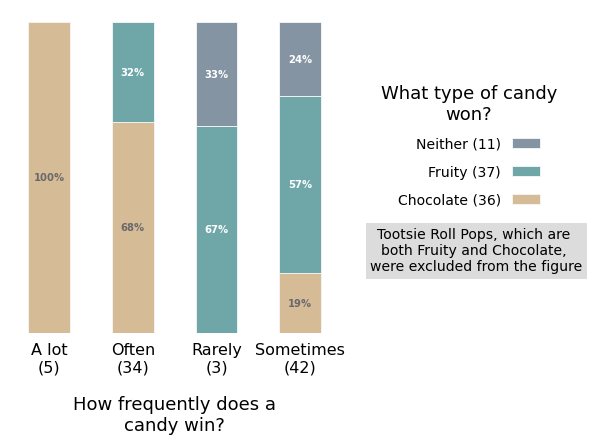
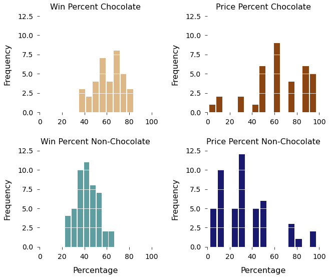
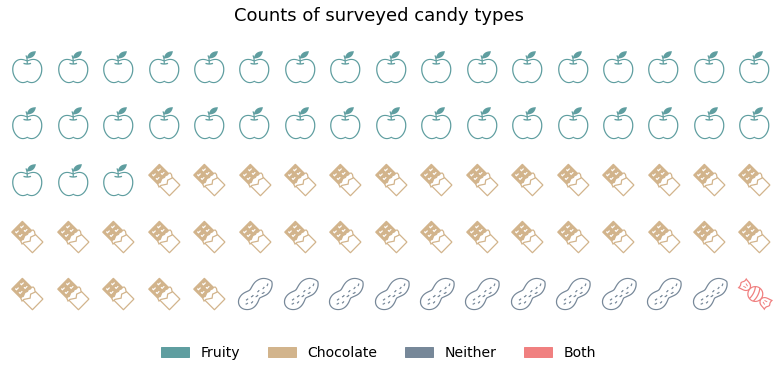

# Candy Wars

This project aimed to answer different questions through visualizations on [The Ultimate Halloween Candy Power Ranking](https://fivethirtyeight.com/videos/the-ultimate-halloween-candy-power-ranking/) data.  The data represents the results from an online survey conducted by fivethirtyeight where participants were asked which of two candies they preferred--the [original data](https://github.com/fivethirtyeight/data/tree/master/candy-power-ranking) was altered.  From this project, I learned how to create plots with the matplotlib library in Python.

## Questions

**Does chocolate reign supreme?**

`Win_cat` and `is_chocolate` were the two variables used to relate to the win
percentage because these columns gave the frequency counts that could be converted
to percentages in the crosstab.  I didn’t use `win_percent` because it is a continuous
variable that included distinct values so the graph would have had 84 unstacked bars.

From the visualization, frequent winners seen in the `A lot` and `Often` categories have
high win percentages of chocolate versus less frequent winners seen in the `Rarely` and
`Sometimes` categories having high win percentages of fruity.

 

**How do chocolate and non-chocolate candies differ in winningness and price?**

Both winning percent distributions show a symmetrical mound shape centered around
60% for chocolate and 40% for non-chocolate. For the price percent distributions, the
shape shows a mounded curve that ascends upward towards 60% then tapering off in
chocolate and descends downward around 30% after rising up in non-chocolate.

 

**How many of each type of candy were in the original survey?**

